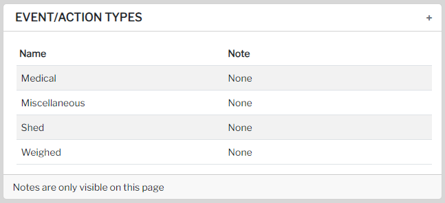

In order to add events/actions to your animals, it is essential to create corresponding event/action types first. These types can be easily created on the settings page.

## Event/Action types

To add a new event/action type, simply navigate to the `Settings` page.

By creating specific event/action types, you can better organize and manage the events and actions related to your animals. This will ensure a more streamlined and efficient process when recording and tracking their activities.

