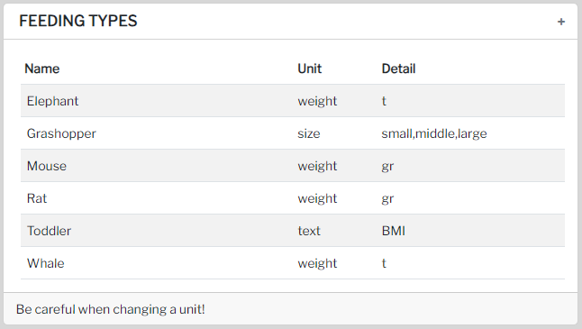
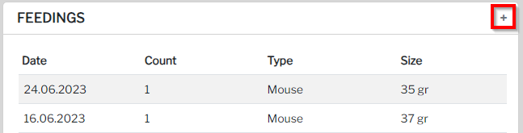
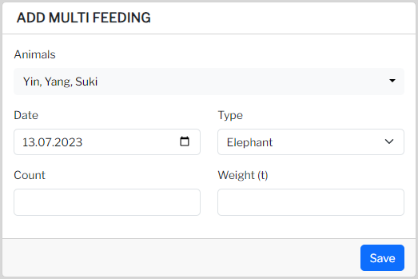
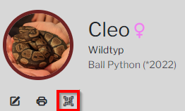
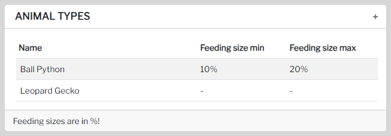

To ensure proper feeding documentation for your animals, it's essential to create feeding types first. This can be easily accomplished on the settings page.

## Feeding types

To add a new feeding type, simply navigate to the `Settings` page.

### Feeding type options

When creating a feeding type, you can specify the following details:

#### Name
Name of the feeding type

#### Unit
Select the appropriate unit for the feeding type.

#### Detail
The specific details vary depending on the selected unit. Here are the available options:

  - Size: Specify a comma-separated list of options.
  - Text: Add descriptive text without any additional options.
  - Weight: Specify the unit for weight measurement.

### Add Feeding

There are multiple methods to add feedings for your animals:

#### Animal Page

Access the animal page corresponding to the specific animal you wish to feed, and click on the `+` button located at the top right.

#### Multi-Feeding

Alternatively, visit the Multi-Feeding page to select and feed multiple animals at once.

#### QR-Code
For added convenience, utilize the QR-code feature to access a separate page for feedings. The QR-Code can be found on the respective animal page.

## Recommended feeding weight
To accommodate certain animals' specific needs based on their current weight, it's essential to adjust the feeding size accordingly. The feeding weight will be automatically calculated based on the last recorded weight of the animal.

### Modifying Feeding Sizes

To customize feeding sizes for different animal types, head to the settings page.

By incorporating these features, you can optimize and streamline the feeding process for your animals. If you have any further questions or require assistance, please feel free to reach out to us. We're here to help you provide the best care for your animals!