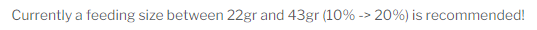

To add feedings to your animals you have to create feeding types first. They can be created on the settings page.

## Feeding types

To add a feeding type, visit the `Settings` page.

### Feeding type options

#### Name
Name of the feeding type

#### Unit
The unit for the feeding type

#### Detail
The detail depends on the selected unit. Here you can add the following things:

  - Size: comma separated list of options
  - Text: text without any options
  - Weight: weight unit

### Add Feeding

There are multiple ways to add a feeding to your animal.

#### Animal Page

Visit the animal page for the animal you want to add the feeding to and then press the `+` button on the top right.

#### Multi-Feeding

Visit the Multi Feeding page and select the animals ou did feed.

#### QR-Code
You can use a QR-code to open a separate page for feedings. The QR-Code can be found on the animal page.

## Recommended feeding weight

For some animals it is required to change the feeding size according to there current weight. The feeding weight will be calculated based on the last recorded weight of the animal.

### Add feeding sizes

You can change the values for feeding sizes per animal type on the settings page.

