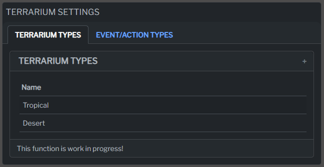

In addition to tracking feedings and events, Personal Zoo now offers the ability to add and manage Terrariums! With this new feature, you can easily keep track of your reptile habitats and ensure your scaly friends have the best living conditions.

## Add a New Terrarium

To get started, simply navigate to the "Add Terrarium" page, where you can effortlessly create a new terrarium. Choose a suitable name for your habitat and select the appropriate note that describes its unique features.

## Terrarium Types

With Personal Zoo, you are in full control of your terrarium types! Define and create new terrarium types in the Settings page, allowing you to categorize them based on their specific characteristics and unique features.

## Event/Action Types: Comprehensive Tracking

Not only can you customize your terrarium types, but you can also create event/action types tailored to your animal care needs. Define different event and action categories to precisely track various occurrences and activities related to your animals.

## Add Lamps and Equipment

On the terrarium page, you can easily add lamps and other essential equipment to each terrarium.

## Events

Personal Zoo continues to provide a dedicated section for tracking events. Use this feature to record lamp replacements, cleanings, and other noteworthy happenings to keep a detailed record of your animals' well-being.

 
 
With the addition of Terrariums, Personal Zoo becomes an even more versatile tool for managing your personal zoo effectively. Enjoy the convenience of tracking feedings, events, and now, the well-being of your reptile habitats all in one place!
